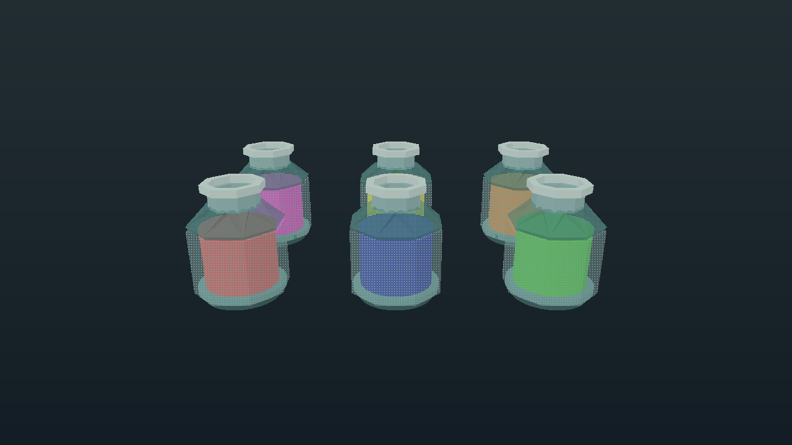
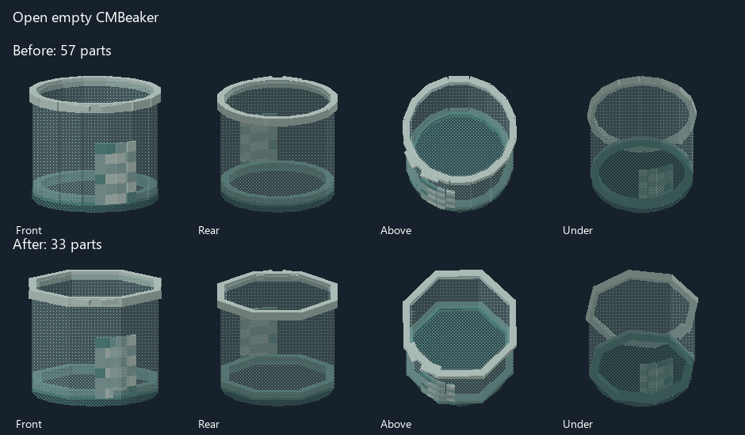
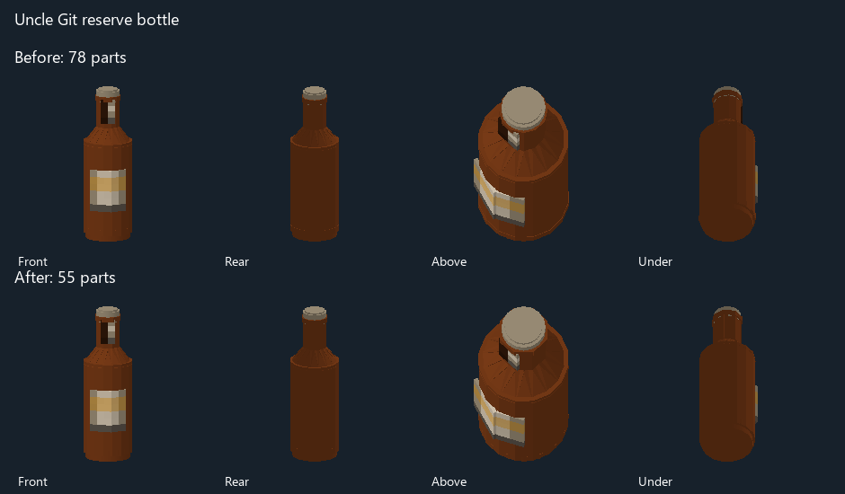

# Container geometry review

The bicaridine bottle and related small containers were built with repeated
twelve- or sixteen-segment rings. The native renderer tests these individual
solids when tracing a spatial cell. This revision simplifies 46 draft models
and their corresponding authored poses without changing the renderer.

Default assemblies total 2,848 parts before and 1,710 after (40% fewer).
Filled chemistry bottles fall from 80 to 37 parts each (54% fewer).
Open rings use eight joined facets, with wider tangents so adjacent sides meet.
Bands over already closed bases use one capped cylinder. Beakers keep their
ring feet and translucent floors. Label-bearing alcohol bottle and can bodies
retain their existing segments to avoid covering their source artwork.

The silhouette is more visibly faceted at close range. Source textures,
prototype bindings, colors, liquid volumes, draft statuses, animation timings
and state selection remain unchanged. This does not add live liquid or lid
selection to chemistry drafts that lacked it.

## Native renderer measurement

Six chemistry bottles arranged in two rows of three, rendered at 1280 by 720
on an NVIDIA RTX 4070 Ti SUPER. The real C# extended scene encoder and the
unchanged production shader were used through `validate_native_shader.py`,
with a temporary packed fixture and framebuffer capture. Each variant used
three warmup draws and twelve measured `GL_TIME_ELAPSED` samples.

| Measure | Before | After |
|---|---:|---:|
| Admitted parts | 480 | 222 |
| Spatial references | 580 | 322 |
| Omitted parts | 0 | 0 |
| Median GPU draw, native sRGB + uniform buffers | 2.855 ms | 1.670 ms |
| Median GPU draw, neither option | 2.920 ms | 1.714 ms |

This is about 42% less GPU time for this isolated scene. It is **not a whole-game
FPS measurement** or a measurement on the reporter's hardware. No map, UI,
sprites, live lighting, server simulation or networking were included.
Camera, fixture layout, shader hash and per-model counts are recorded in
[measurements.json](measurements.json). Baseline: `ec88fbf9d62`.

Before:

After:

## Geometry and export checks

- `python -m unittest discover -s Tools/three_d/tests -p test_models.py`: 26 passed.
- `powershell.exe -NoProfile -File .codex/scripts/run.ps1 test -Project Content.Tests -Configuration Release -Filter 'FullyQualifiedName~CMU3DLibraryBudgetTest'`: passed; all library models fit the production encoder's per-model budget.
- The normal exporter validated all 69 models in the three touched families;
  all 46 changed GLBs were regenerated, reproduced byte-for-byte and matched
  their updated manifest hashes and geometry counts.
- Temporary geometry checks covered 141 eight-facet rings at 721 azimuths each:
  every horizontal ray from the cavity met a wall, and ring centres remained
  open. Non-geometry metadata was compared against the baseline for all 98
  default/pose part lists.
- Front, rear, overhead and underside software reviews covered the bottle,
  empty bottle, jug, Bobda can, alcohol bottle, beaker and coffee cup. Native
  shader compile/link and existing rendered-pixel smoke checks passed for
  both shader variants during the measurement.

These checks cover the asset change. A full multiplayer round and lower-end
GPU comparison were not performed. The 2D renderer and server behavior were
not modified.

The images depict derivative draft geometry and original source labels.
Attribution and applicable share-alike licenses remain in
[containers](../../SOURCES_CONTAINERS_CLOUD.md),
[drinks](../../SOURCES_DRINKS_EXTRA_CLOUD.md) and
[medical props](../../SOURCES_MEDICAL_SMALL_CLOUD.md).
