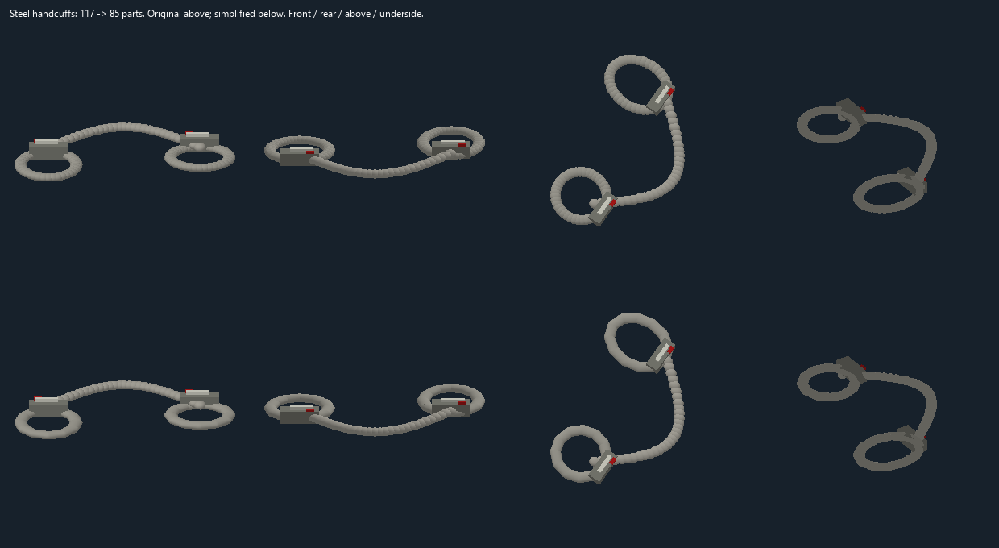

# Whole-library geometry cost audit

This pass audits all **2,476 models** after the bottle/container simplification
in `5b143c7a3ee`: 1,676 world models and 800 equipment-only drafts. The scan
includes 3,663 authored part lists, covering defaults and stored states.
[models.csv](models.csv) records the result and counts for every model;
[changed-states.json](changed-states.json) lists every changed part list.
The current counts here supersede construction counts in older family notes;
those notes retain their original source evidence and attribution.

**117 additional world models** are simplified. Their default assemblies use
5,904 parts instead of 6,640 (736 fewer); including stored states removes
1,765 parts across 193 part lists. This is additional to the earlier 46-model
[container pass](../ContainerSimplification/README.md).

| Example | Default parts before | After |
|---|---:|---:|
| Large bowl | 50 | 26 |
| Rice and egg bowl | 113 | 89 |
| Plate | 50 | 38 |
| Steel handcuffs | 117 | 85 |
| Tom drums | 90 | 74 |
| Potted plant 11 | 49 | 33 |
| Red door button | 56 | 31 |
| Machine frame | 68 | 52 |

## Changes and retained detail

Same-material, untextured, opaque boxes with matching cross-sections are
joined where their occupied volume is continuous. Fully contained solids of
the same material are removed. This reduces repeated pixel strips on door
buttons, medical pods, consoles, clothing and other props. The existing
button-source projection test now rasterizes the full height of a joined
solid; its expected original sprite pixels and overlap checks are unchanged.

Small circular walls and rims use eight or twelve joined facets where the
shape allows it. Bowls retain open interiors, pots retain their openings and
soil, and handcuffs use connected cylinders with rounded joints. These
curves look more faceted close up. Food contents, printed surfaces, colors,
source references, prototype bindings, state keys, animation timings and
draft statuses remain unchanged. Connected walls and context-dependent
corner geometry are excluded from automatic compaction.

The original produce curves and Hybrisa glass-door partitions are retained:
simplifying them changed the silhouette or overlapping material appearance.
The large remaining world models include the railroad bend (127 parts), a
bush (126), a cargo truck (125), and broadleaf trees (124). Their curvature,
foliage, cargo and separate materials need individual art decisions for
larger reductions. A high part count alone does not establish a runtime
bottleneck; visible instances and screen coverage matter too.

Equipment-only drafts account for 170,129 default parts. They were included
in the structural/cost audit and retained. This asset pass does not enable
worn or held 3D equipment on mobs. Six existing manifest hashes for equipment
GLBs were stale; the GLB bytes already matched the exporter, so only those
hashes were corrected.

## Native renderer measurement

One bowl, handcuffs, plate, rice bowl, tom drums and potted plant, at 1280 by
720 on an NVIDIA RTX 4070 Ti SUPER. The actual C# extended scene encoder and
unchanged production shader were used with a temporary packed scene fixture.
Each variant used three warmups and twelve `GL_TIME_ELAPSED` samples.

| Measure | Before | After |
|---|---:|---:|
| Admitted parts | 469 | 345 |
| Spatial references | 652 | 510 |
| Omitted parts | 0 | 0 |
| Median GPU draw, native sRGB + uniform buffers | 1.016 ms | 0.779 ms |
| Median GPU draw, neither option | 1.040 ms | 0.785 ms |

This is about 23% less GPU time for this isolated scene. It is **not a
whole-game FPS measurement**, a multiplayer test, or a measurement on the
reporter's GPU. The fixture excludes map rendering, UI, live lighting,
sprites, networking and server simulation. Camera, layout, shader hash and
measurements are recorded in [measurements.json](measurements.json).

Before:

After:

## Verification and review coverage

- Normal exporter validation covered all 2,476 models. All 117 changed GLBs
  were regenerated and reproduced byte-for-byte; unchanged exports also
  matched. Every final manifest hash and count was checked.
- Non-geometry metadata was compared against the baseline in every changed
  source file. No source textures or family license files were replaced.
- Temporary geometry checks verified 631 box unions, nine conservative
  ellipsoid containments, and 25 simplified rings at 721 azimuths each.
  Ring centres remain open and every horizontal ray meets a side wall.
- Four-view before/after reviews covered the **117 changed default models**:
  front, rear, overhead and underside, at matched scale. 88 are pixel-identical
  in those software views. This is not a manual visual approval of all 2,476
  models or of every possible runtime state.
- `PYTHONPATH=Tools/three_d python -m unittest discover -s Tools/three_d/tests`:
  **338 passed**. On Windows, set `$env:PYTHONPATH='Tools/three_d'` first.
  The suite requires local generated fixtures from
  `python Tools/three_d/inventory.py` and
  `python Tools/three_d/barricade_state_review.py`.
- `powershell.exe -NoProfile -File .codex/scripts/run.ps1 test -Project Content.Tests -Configuration Release -Filter 'FullyQualifiedName~ThreeD'`:
  **Passed: 641, Failed: 0, Skipped: 0**, including the content build.
- `python Tools/three_d/validate_native_shader.py --root . --powershell <pwsh>`:
  native shader compilation and existing rendered-pixel smoke checks passed
  for both shader variants. The fixture timings were collected separately.

No renderer, engine, server, AI or 2D behavior was changed. Existing draft
limitations remain; this pass does not certify state completeness, sprite
fidelity, map placement, or performance for a full multiplayer round.

## Comparison sheets

Rows are sorted by full model ID. The CSV gives the page and one-based row
for each changed model. Each angle has the original on the left and the
optimized model on the right.

[01](page-01.png) · [02](page-02.png) · [03](page-03.png) ·
[04](page-04.png) · [05](page-05.png) · [06](page-06.png) ·
[07](page-07.png) · [08](page-08.png) · [09](page-09.png) ·
[10](page-10.png) · [11](page-11.png) · [12](page-12.png)

These images depict derivative draft geometry. Original source attribution
and applicable licenses remain in the `SOURCES_*.md` family notes in the
[model directory](../..), and the source RSI metadata named by each model.
