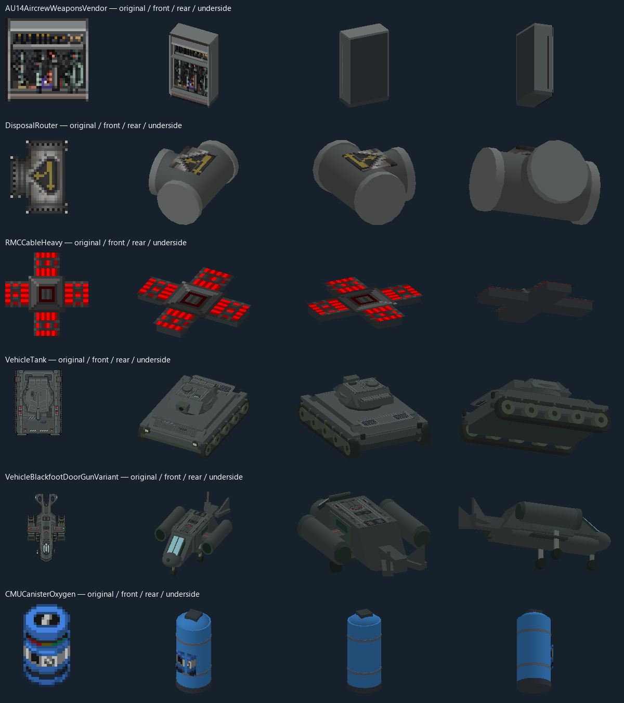
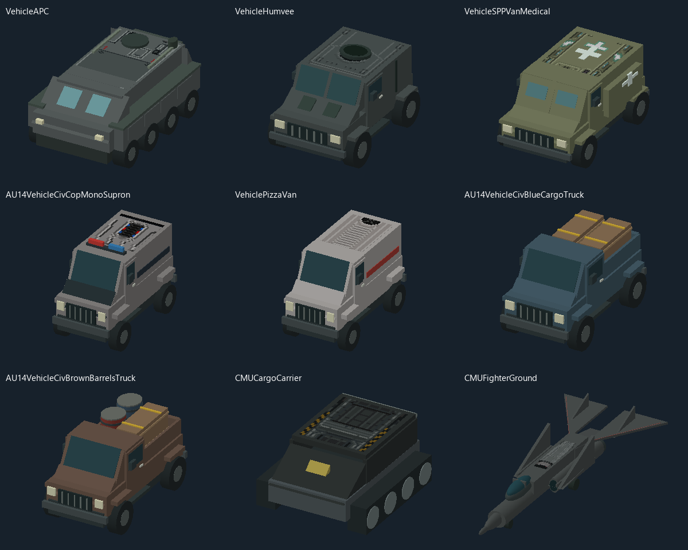
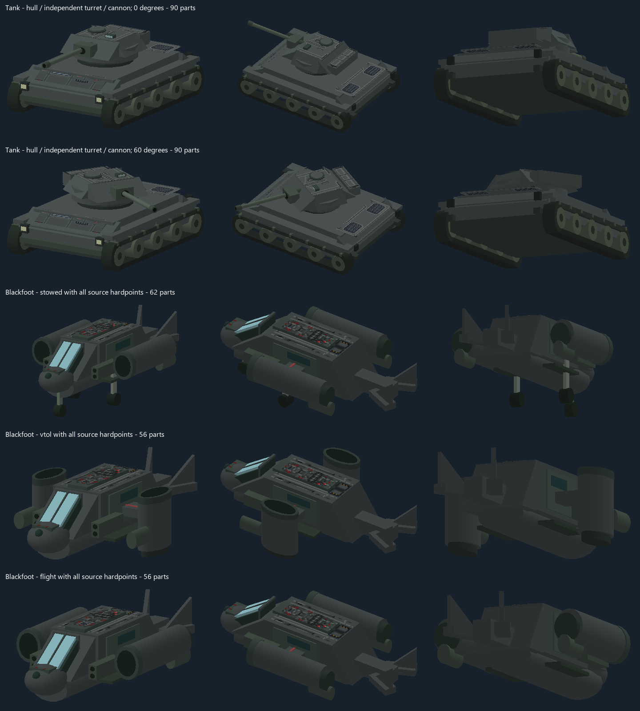

# Stable Garrison Redux model coverage

This pass adds 155 draft model entries and 225 exact world-prototype bindings.
The audit follows all seven Redux levels, hidden subfloor placements, recursive
map spawners, faction vendor markers, platoon vehicle catalogs, every concrete drivable vehicle and faction
terminals. It finds 1,754 valid physical prototype types: 1,746 have exact model
bindings, four have conditional sprite-selected models, and four use existing
native stairs or atmospheric/void presentation. No valid audited type is left
without one of those paths. This measures bindings, not complete live-state fidelity.

The additions include 110 faction vendor bindings, both cable families and their
16 connection masks, straight/bent/routed/trunk/Y disposal castings and construction
poses, 48 drivable vehicle variants, 35 mounted turret item variants, oxygen
canisters, machinery, shaft walls, ladders, lift platforms and loose map props.
The flipped router is also modeled so flipping a mapped router keeps its geometry.

All new default models are below the existing 128-part limit; the largest is
71 parts. Vehicle hulls, wheel layers and installed equipment are composed from
the actual visible source states. Independent turret entities use physical yaw,
not the camera-facing rotation applied to their 2D sprite layers. Removing or
changing a hardpoint changes its modeled assembly. Unknown equipment states
retain the original sprite rather than silently losing equipment.



## Complete drivable fleet pass

All 48 concrete `GridVehicleMover` variants now select one of 42 shaped body
models, including civilian and admin-spawnable vehicles outside platoon supply
catalogs. Seventeen body entries are added in this pass; the existing vehicle
entries are refined. Loaded/armed variants share their source chassis and retain
separate visible equipment layers.

- APCs and Humvees have sloped armor, cab glass, wheels, access panels and hatches.
- Military/civilian vans retain their paint and medical, police, delivery,
  logistics or prisoner details. Loaded trucks have solid crates and drums;
  garbage and medical trucks use their own cargo bodies.
- The tracked carrier has an open cargo bay and a separate closed-lid pose.
- The fighter has a tandem canopy, swept solid wings, forked tail, engine
  nozzles, landing gear and folded/flight/VTOL poses at its original sprite scale.
- The TWE tank uses its own 96-pixel source-frame scale. The engineering hull
  has no turret race. The Blackfoot parachute overlay no longer adds another hull.
- The marshal and pizza vans use the new layer-aware models; their former static
  drafts remain available for reference without competing world bindings.



Every body was rendered beside its original sprite from the front, rear and
underside. The gallery also includes the carrier opening and fighter flight poses:
[1](fleet-01.png), [2](fleet-02.png), [3](fleet-03.png), [4](fleet-04.png),
[5](fleet-05.png), [6](fleet-06.png), [7](fleet-07.png), [8](fleet-08.png),
[9](fleet-09.png). Counts are recorded in [fleet-review.json](fleet-review.json).
These are model renders, not screenshots of a live driving session.

The fleet audit checked exactly one body binding per vehicle, the authored
sprite scale, every initially visible source layer, positive volume and closed
primitive geometry, and ground clearance after part rotation. The largest
initially visible body composition is 86 parts / 2,616 triangles, below the
128-part limit. This is a geometry count, not an FPS measurement.

The complete Redux batch uses 210 source crops (previously 329), with obsolete
batch crops removed. All 155 batch GLBs were rebuilt and the complete library's
2,631 manifest hashes verified. The client-only optional-library load/reset/reload
integration test passed; affected content projects built through the test wrapper.

Fleet verification commands:

```powershell
python Tools/three_d/author_redux_coverage.py --skip-reviews
python Tools/three_d/build_models.py --source Content.CMU/Resources/ThreeD/Prototypes/World/garrison_redux_missing.yml --output .codex/logs/redux-coverage/export --viewer-output .codex/logs/redux-coverage/viewer --no-review
python Tools/three_d/review_redux_fleet.py
powershell.exe -NoProfile -File .codex/scripts/run.ps1 test -Project Content.IntegrationTests -Filter 'FullyQualifiedName~OptionalLibraryLoadsOnlyOnClientAndCanReloadAfterPrototypeReset'
```

## Tank and Blackfoot refinement

The tank hull now has a sloped glacis, separate skirts, continuous track runs,
road wheels and a fixed turret race. The turret, hatch, mantlet and cannon are
separate solids. Turret and attached weapon placement uses a fixed mount in the
authored source frame, so aiming rotates those parts without moving the hull or
switching mount offsets at 2D cardinal boundaries.

The Blackfoot now has a shaped fuselage, canopy, forked tail, short wings, side
doors, landing gear and engine nacelles. Stowed, hover and flight states select
different engine/gear poses. Door-gun, recon and radar source images contain a
copy of the whole aircraft; only their changed hardware is modeled as an
attachment. The earlier aircraft-sized opaque attachment blocks are removed.
The 2D takeoff screen offset no longer makes the 3D aircraft fall back to a sprite.



The illustrated tank composition is 90 parts / 2,872 triangles across its hull,
turret and cannon. The illustrated Blackfoot is 62 parts / 2,076 triangles stowed,
and 56 parts / 1,848 triangles airborne. These are geometry counts, not an FPS
benchmark. Solid volumes and source panels were reviewed from front, rear and
below; live driving and flight still need in-game acceptance.

Refinement verification: all four `CMU3DVehicleAppearanceTest` cases passed,
including `CannonRotatesAroundItsTurretWithoutChangingMountAtCardinalBoundaries`.
The client-only library reload integration test also passed against the refined
assets. The export validator checked the full library and all 2,614 GLB hashes.

## Earlier infrastructure verification

- Content client, shared and server projects built through the repository test wrapper.
- 14 focused C# cases passed: `CMU3DVehicleAppearanceTest` and `CMU3DAnchorStateTest`.
- All four `CMU3DModelLoadingTest` integration cases passed, covering optional
  client-only loading, workbench selection, library release/reopen and texture loading.
  `OptionalLibraryLoadsOnlyOnClientAndCanReloadAfterPrototypeReset` also passed
  again against the final generated assets.
- 338 existing Python asset-tool tests passed with `Tools/three_d` on `PYTHONPATH`.
- The new GLBs were regenerated with `build_models.py`; all delivered manifest
  file hashes were verified. Source references and positive-volume geometry were
  validated, and source/front/rear/underside review sheets were generated.
- `redux_coverage.py` reports no missing bindings among resolved physical types.

Focused commands:

```powershell
powershell.exe -NoProfile -File .codex/scripts/run.ps1 test -Project Content.Tests -Filter 'FullyQualifiedName~CMU3DVehicleAppearanceTest|FullyQualifiedName~CMU3DAnchorStateTest'
powershell.exe -NoProfile -File .codex/scripts/run.ps1 test -Project Content.IntegrationTests -Filter 'FullyQualifiedName~CMU3DModelLoadingTest'
```

| Regression | Test |
| --- | --- |
| Removing a hardpoint or switching damage state changes only the visible assembly and preserves published snapshots | `RemovingHardpointAndChangingDamageStateRebuildsOnlyVisibleAssemblies` |
| Unrecognized equipment cannot silently disappear from a modeled vehicle | `UnknownStateOrResourceCannotSilentlyDiscardInstalledEquipment` |
| Mounted turrets use physical yaw without replacing unrelated/dropped items | `MountedTurretUsesItsOwnPhysicalYawWithoutBindingDroppedOrUnrelatedItems` |

## Limits and unresolved source data

These remain drafts. Inferred height, hidden construction and material response
need in-game acceptance. Lift travel, gear-wall animation, wheel texture animation,
aircraft effects and every small-item light/charge/stock overlay are not reproduced
by these static solids. The test results do not establish FPS or multiplayer
driving smoothness. No game collision, map elevation, AI or mob equipment behavior
is changed, and the existing optional-library lifecycle remains in place.

Six saved-map references have missing content definitions or missing parents:
`CMUGasPipeStraightAlt2`, `CMUGasThermoMachineFreezer`, `CMVentPump`,
`RMCGasPipeBend`, `RMCGasPipeStraight`, and `RMCGasPipeTJunction`.
They are reported separately in `coverage.json`; this pass does not invent gameplay
prototypes to bind them. `ChunkEntity` is an engine-owned, sprite-less map helper,
and is excluded from physical-model coverage.

Authoring and source/license notes: [SOURCES_REDUX_COVERAGE.md](../../SOURCES_REDUX_COVERAGE.md).
The procedural authors are `Tools/three_d/author_redux_coverage.py`,
`Tools/three_d/redux_vehicle_shapes.py` and `Tools/three_d/redux_fleet_shapes.py`; the independent
coverage audit is `Tools/three_d/redux_coverage.py`.
